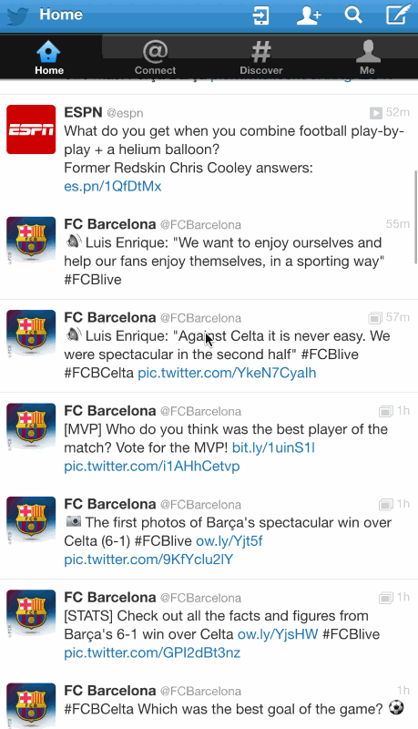

Twitter

## User Stories

Time spent: **8.5** hours spent in total

The following **required** functionality is completed:

- [x ] Tweet Details Page: User can tap on a tweet to view it, with controls to retweet, favorite, and reply.
- [x ] Profile page:
   - [ x] Contains the user header view
   - [x ] Contains a section with the users basic stats: # tweets, # following, # followers
- [ x] Home Timeline: Tapping on a user image should bring up that user's profile page
- [x ] Compose Page: User can compose a new tweet by tapping on a compose button.

The following **optional** features are implemented:
   - [ x] Implement the paging view for the user description.

The following **additional** features are implemented:

- [ ] List anything else that you can get done to improve the app functionality!

GIF created with [LiceCap](http://www.cockos.com/licecap/).

## License

    Copyright 2016 went,cui

    Licensed under the Apache License, Version 2.0 (the "License");
    you may not use this file except in compliance with the License.
    You may obtain a copy of the License at

        http://www.apache.org/licenses/LICENSE-2.0

    Unless required by applicable law or agreed to in writing, software
    distributed under the License is distributed on an "AS IS" BASIS,
    WITHOUT WARRANTIES OR CONDITIONS OF ANY KIND, either express or implied.
    See the License for the specific language governing permissions and
    limitations under the License.
